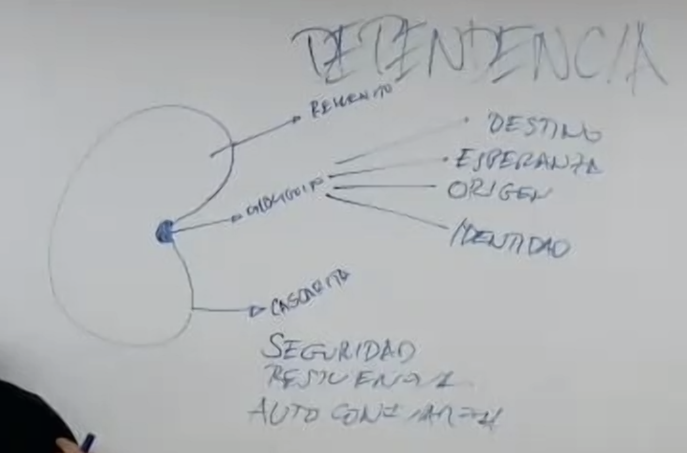
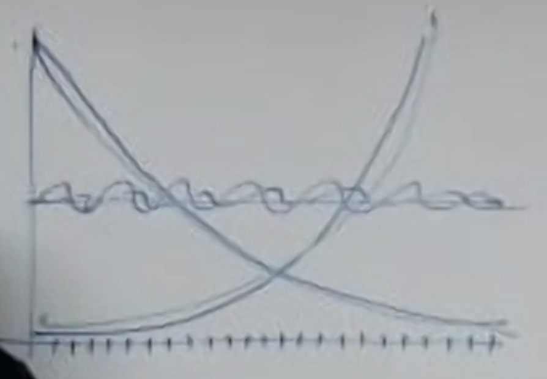

# Día 13

- Alimento de construcción
- Alimento de transmutación

## Alimento de construcción

- Leche
- Fermentos frescos de leche
- Carbohidratos
- Harinas
- Azucares

## Alimento de transmutación

- Queso maduros
- Fermentos
- Curados
- Salados
- Destilados

## Siempre

- Proteinas
- Grasas
- Vegetales

[William Duffy - Sugar Blues](https://www.amazon.co.uk/Sugar-Blues-William-Dufty/dp/0446343129)
