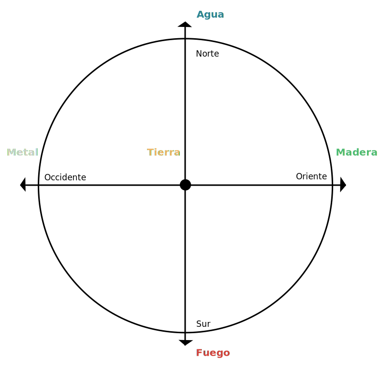
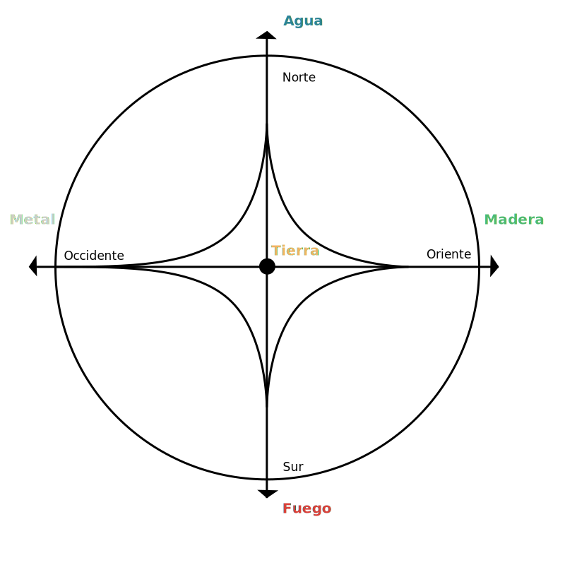
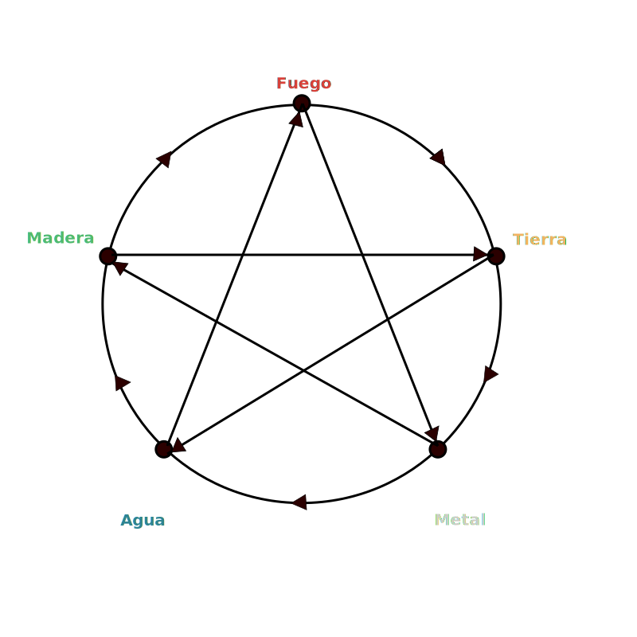

## Día 3

- Mientras nos acercamos al Ecuador vammos rapido
- En latitudes mas lejanos van mas lenta por lo tanto las energias se manfiestan mas nitida
- La tierra se mueve en el espacio como una pelota volleyball dentro de una piscina
- Si puedo entender lo que pasa afuera, puedo entender lo que pasa adentro

### El circula de construction y destructions de los procesos elementales

- la explicacion va directo a la mente y complica, si vamos a las experimentacion ... implica

| Madera                  | Fuego              | Tierra                       | Metal                      | Agua            |
| ----------------------- | ------------------ | ---------------------------- | -------------------------- | --------------- |
| Oriente                 | Sur                | Centro                       | Occidente                  | Norte           |
| Primavera               | Verano             | Veranillo                    | Otoño                      | Invierno        |
| Ira                     | Alegria            | Ansiedad                     | Tristeza                   | Miedo           |
| Luna creciente          | Luna Llena         |                              | Luna Menguante             | Luna Llena      |
| Vista                   | Gusto              | Tacto                        | Olfato                     | Oido            |
| Ojos                    | Lengua             | labios y puntas de los dedos | Nariz                      | Orejas          |
| Amanecer                | Medio dia          |                              | Atardecer                  | Media noche     |
| Verde / Rosado          | Rojo / Naranjas    | Terracota / ocre /mostaza    | Blanco / negro / gris      | Azul            |
| Acido                   | Picante que quema  | Dulce                        | Amargo / Picante que corta | Salado          |
| Flores / Brotes / Hojas | Frutos perecederos | tuberculos / raices dulces   | semillas / granos          | Troncos / ramas |

- Cuando potencio un proceso fumdamental tambien potencia el hijo
- Todo elemento tiene conexion con los demas:
  - Puede ser controlado
  - Controla
  - Es hijo
  - Es Madre

