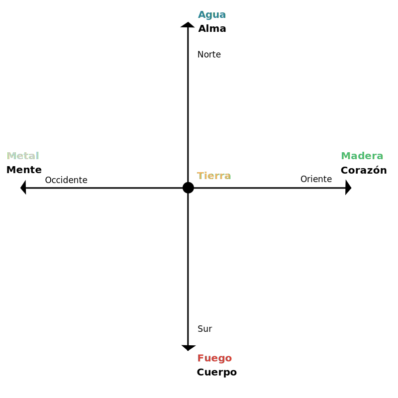
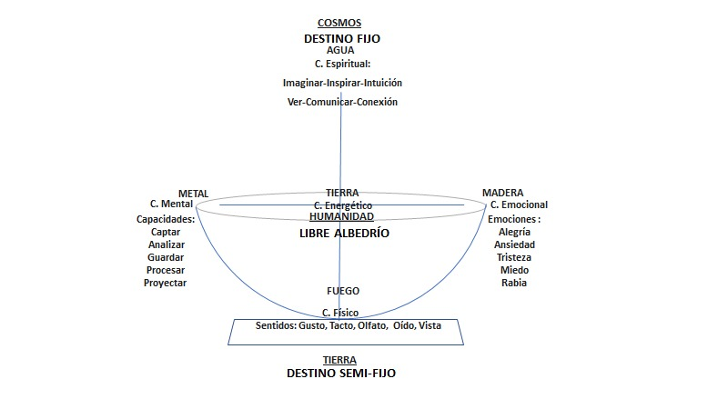

# Dia 5

- Nuestra relación con el cosmos es el destino
- El destino es fijo
- La naturaleza son las herramientas que tenemos para cumplir para el destino, son semi fijas
- El libre albedrío es nuestra relacion con los humanos

## Naturalezas

- Herramientas naturales para que nuestro destino se manifieste
- Fisionomia
- Hay 24 conjugaciones de naturalezas

```txt
  A > 50 --> naturaleza
  B ~ 25 --> aliada
  C ~ 15 --> neutral
  D < 10 --> debilidad
```

| Madera  | Fuego      | Tierra | Metal      | Agua      |
| ------- | ---------- | ------ | ---------- | --------- |
| Corazon | Cuerpo     |        | Mente      | Alma      |
| Emoción | Percepción |        | Razón      | Intuición |
| Músico  | Acción     |        | Estrategia | Visión    |



### Cuerpo

- Basaria todas sus interacciones con las percepción sensorial
- Capta
- Combina
- Transmite
- Táctico
- Vive en el ahora

### Mente

- Razon
- Proyecta
- Vive en el futuro

### Alma

- Intuición
- Es la conexion con el mundo espiritual
- la intuicion no tiene sentido logico pero es cierta
- Certeza

### Corazon

- Emociones
- Como me siento
- Conectar
- Inspirar
- Nos recuerda
- Nos toca el corazón
- Vive en el pasado?



## Investigar

- [Pantocrato tretamorfo](https://en.wikipedia.org/wiki/Tetramorph)
- [Cristo pantocrato](https://en.wikipedia.org/wiki/Christ_Pantocrator)
- [Theun Mares](https://www.toltec-legacy.com/public/introduction)
